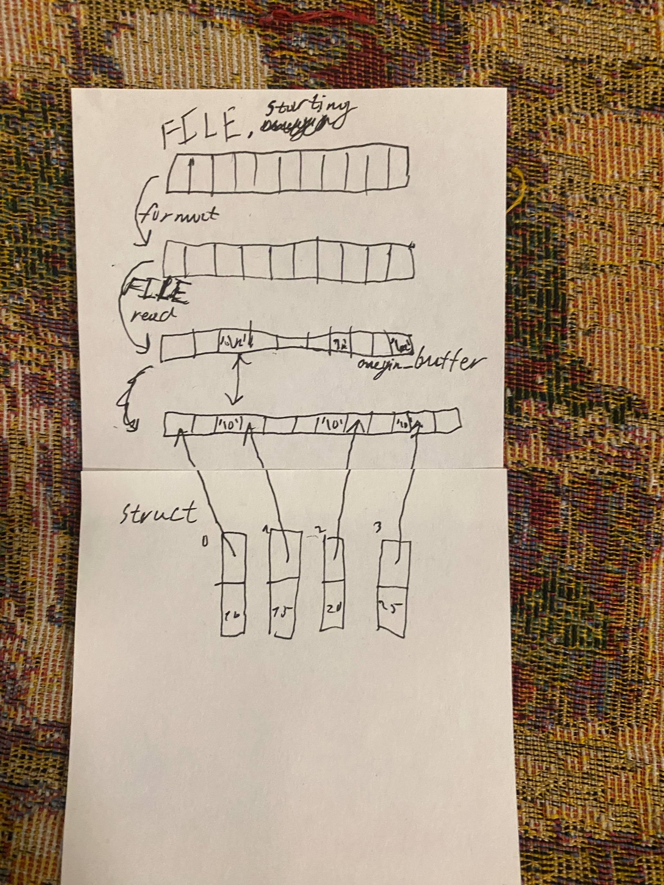

# onegin_bread_generator
"Энциклопедия русской жизни" на базе Евгения Онегина.
Просто загрузи свой файл Онегина или другого стиха, укажи форматную строку в вызове функции init_onegin_file и наслаждайся 14 строчными бредовыми стишками в форме строфы онегина!
</img>
